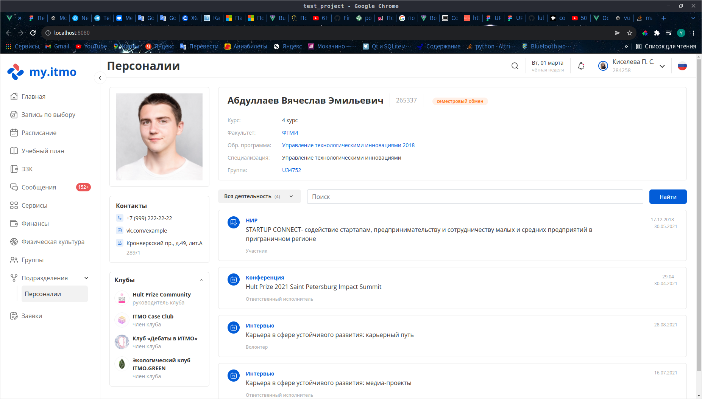

# Personalities page



To change the user type, change the role parameter in the userModule Vuex memory module. Possible values:
* _employee_ 
* _student_ 
* _teacher_ 
* *student_employee* - student+employee

### Figma layout

https://www.figma.com/file/7q1UtdoGdLASCHekKvSY69/%D0%9F%D0%B5%D1%80%D1%81%D0%BE%D0%BD%D0%B0%D0%BB%D0%B8%D0%B8?node-id=0%3A1

## Project setup
```
npm install
```

### Compiles and hot-reloads for development
```
npm run serve
```

### Compiles and minifies for production
```
npm run build
```

### Lints and fixes files
```
npm run lint
```

### Customize configuration
See [Configuration Reference](https://cli.vuejs.org/config/).
